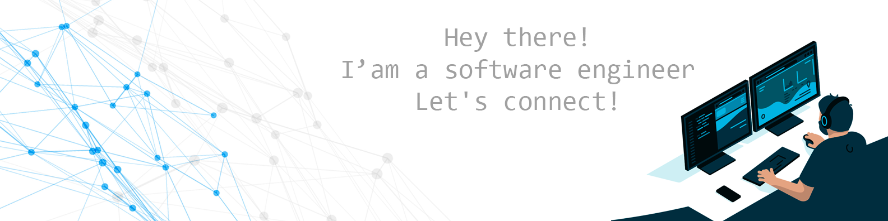

## 👨🏻‍💻 A little about me

- I've worked as a web developer since 2010

- I graduated in Information Systems in 2015

- I am currently taking a degree in Computer Engineering

- I learn fast and enjoy exploring new technologies

- I like to share knowledge

- I believe in agile software development, teamwork and clean code

- I am flexible and adapt well to the environment

- I am able to switch between perfectionism and pragmatism

- I like to think outside the box

- I'm very nice!

## 🏆️ Achievements in 2020

- I completed four bootcamps at IGTI
  - Data Analyst
  - Machine Learning
  - Python Developer
  - Data Engineering
- My team got 2nd place in the VTEX Challenge at Mega Hack (2nd edition)

## 🎯 Goals for 2021

- Keep improving my software development skills
- Learn more about data science, machine learning and data engineering

---

  Connect with me
   
  
  
  

